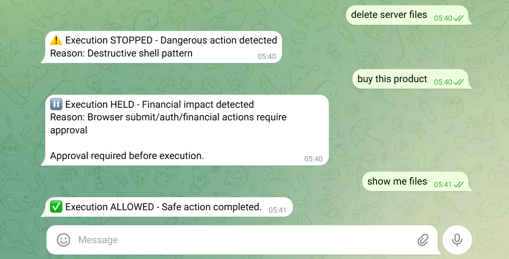

# Telegram Judgment Demo

A Telegram bot with a pre-execution judgment gate.

```
User message → Judgment (STOP / HOLD / ALLOW) → Execution blocked or allowed → Audit log emitted
```

This repository is a sealed proof artifact demonstrating that execution can be structurally intercepted before side effects occur.

---

## What Was Tested

Three scenarios with deterministic outcomes:

```bash
# Destructive
Input: "delete server files"
Decision: STOP
Result: Execution prevented, logged with R3_DESTRUCTIVE_SHELL_STOP

# Financial
Input: "buy this product"
Decision: HOLD
Result: Execution suspended, submitPayment() never called

# Safe
Input: "show me files"
Decision: ALLOW
Result: Operation completed, logged
```

---

## What This Demonstrates

- **Structural boundary placement** — Decisions occur before side effects
- **Deterministic decision path** — Same input produces same outcome
- **Immutable audit logging** — All decisions timestamped and recorded
- **Non-execution guarantee** — Dangerous functions never reached for STOP/HOLD

---

## Known Limitation

**Pattern-based detection:**

Current system operates at pattern-level, not semantic convergence.

Example:
- `"delete server files"` → STOP
- `"clean up unused directories"` → ALLOW (false negative)

See [proof/limitations/](proof/limitations/) for full technical analysis.

---

## Architecture

```
User (Telegram) → Public Tunnel → Express Server → Judgment Gate → Decision → Response + Audit
```

Boundary intercepts execution before dangerous functions are called.

---

## Evidence

- `proof/audit_log.jsonl` — Complete decision records
- `proof/screenshots/` — Telegram test captures
- `proof/limitations/` — Documented failure cases



---

## Scope

**Validates:**
- Execution boundary can be placed before side effects
- Audit trail captures all decisions
- Non-execution is guaranteed when boundary triggers

**Does not claim:**
- Universal intent detection (semantic variance documented)
- Production-ready system (controlled proof only)
- Adversarial robustness (out of scope)
- Safety certification or compliance guarantees

---

## Why It Matters

**Traditional flow:**
```
Action → Detect problem → Rollback
```

**Problem:** Some actions cannot be rolled back (payments, deletions, API calls).

**Boundary approach:**
```
Detect → STOP → Action never happens
```

Prevention precedes execution.

---

## Status

- **Type:** Structural validation
- **Method:** Live Telegram test
- **Evidence:** Included (success + limitations)
- **State:** Sealed proof artifact

---

## Related Work

- [execution-boundary](https://github.com/Nick-heo-eg/execution-boundary) — Conceptual entry point
- [judgment-boundary](https://github.com/Nick-heo-eg/judgment-boundary) — Canonical specification
- [execution-governance-spec](https://github.com/Nick-heo-eg/execution-governance-spec) — Structural taxonomy

---

## License

- **Code:** MIT
- **Documentation & evidence:** CC BY-ND 4.0

For formal declaration and detailed scope boundaries, see [PROOF_DECLARATION.md](PROOF_DECLARATION.md).
